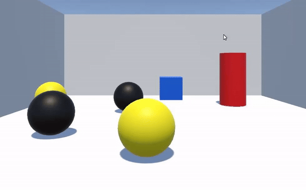
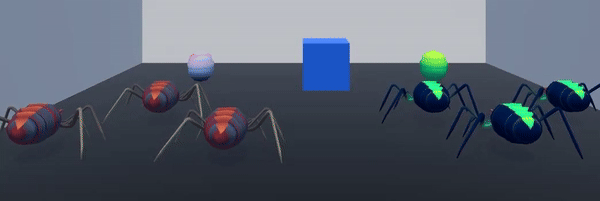
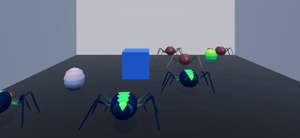
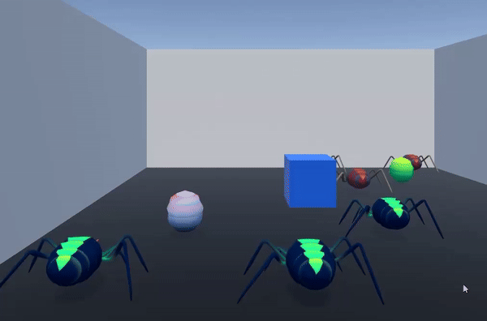
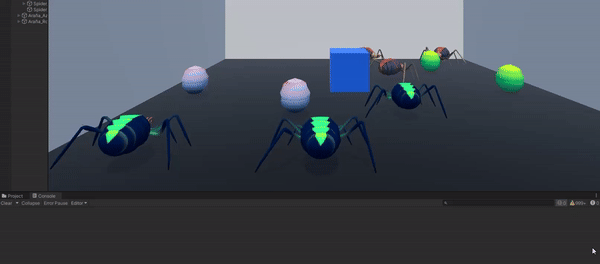
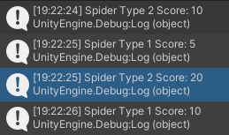
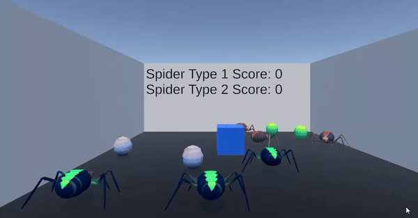
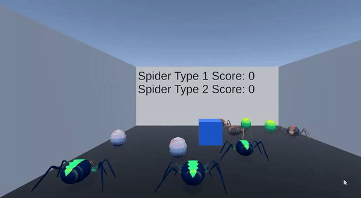

# Práctica 4 - Eventos en Unity
## Aday Cuesta Correa

### Ejercicio 1

- A partir de la escena que has estado utilizando en las últimas prácticas, crea la siguiente mecánica. Cuando el cubo colisiona con el cilindro, las esferas de tipo 1 se dirigen hacia una de las esferas de tipo 2 que fijes de antemano y las esferas de tipo 2 se desplazan hacia el cilindro.

Para lograr esto he creado tags para todos los objetos y he asignado a las esferas un rigidbody, al cilindro también pero además lo he hecho cinemático para que no se mueva de su posición cuando los objetos colisionen con el. El cubo también es un rigidbody.

Para mover el cubo he utilizado el siguiente script de la práctica anterior:

```Cs
public class MoveRigidBody : MonoBehaviour {
  public KeyCode upKey = KeyCode.W;
  public KeyCode downKey = KeyCode.S;
  public KeyCode leftKey = KeyCode.A;
  public KeyCode rightKey = KeyCode.D;
  public float speed = 1.0f;
  private Rigidbody rb;
  void Start() {
    rb = GetComponent<Rigidbody>(); // Obtener el componente Rigidbody
  }
  void FixedUpdate() {
    Vector3 movement = Vector3.zero;
    if (Input.GetKey(upKey)) {
      movement += Vector3.forward;
    } 
    if (Input.GetKey(downKey)) {
      movement += Vector3.back;
    } 
    if (Input.GetKey(leftKey)) {
      movement += Vector3.left;
    } 
    if (Input.GetKey(rightKey)) {
      movement += Vector3.right;
    }
    rb.MovePosition(transform.position + movement * speed * Time.fixedDeltaTime);
  }
}
```

Para que el cilindro envíe los mensajes a las esferas he creado este script:

```Cs
public class CollisionNotifier : MonoBehaviour {
  public delegate void CylinderCollisionHandler();
  public static event CylinderCollisionHandler OnCylinderCollision;
  void OnCollisionEnter(UnityEngine.Collision collision) {
    if (collision.gameObject.tag == "Cube") {
      Debug.Log("Cube collided with cylinder");
      OnCylinderCollision();
    }
  }
}
```

Por último, las esferas de tipo 1 tienen asignado el siguiente script con el que, cuando reciben el mensaje se mueven a la esfera de tipo 2 más cercana que tengan:

```Cs
public class MoveObjectToSphere : MonoBehaviour {
  private GameObject targetSphere;
  private Vector3 targetSpherePosition;
  public float speed = 1.0f;
  private Rigidbody rb;
  void Start() {
    // Inicialmente no hay esfera objetivo
    targetSphere = null;
    rb = GetComponent<Rigidbody>();
  }
  void OnEnable() {
    CollisionNotifier.OnCylinderCollision += MoveToSphereType2;
  }
  void OnDisable() {
    CollisionNotifier.OnCylinderCollision -= MoveToSphereType2;
  }
  void FixedUpdate() {
    if (targetSphere != null) {
      targetSpherePosition = targetSphere.transform.position;
      Vector3 direction = (targetSpherePosition - transform.position).normalized;
      direction.y = 0; // Mantener la componente Y en cero
      rb.velocity = direction * speed;
    } else {
      rb.velocity = Vector3.zero; // Detener el movimiento si no hay objetivo
    }
  }
  void MoveToSphereType2() {
      // Encontrar todas las esferas de tipo 2
      GameObject[] spheres = GameObject.FindGameObjectsWithTag("Type2");
      // Encontrar la esfera más cercana
      float minDistance = float.MaxValue;
      foreach (GameObject sphere in spheres) {
        float distance = Vector3.Distance(transform.position, sphere.transform.position);
        if (distance < minDistance) {
          minDistance = distance;
          targetSphere = sphere;
        }
      }
  }
}
```

Por otro lado, las esferas de tipo 2 tienen el siguiente, con el que se mueven hacia el cilindro cuando reciben el mensaje:

```Cs
public class MoveObjectToCylinder : MonoBehaviour {
  private GameObject cylinder;
  private Vector3 cylinderPosition;
  public float speed = 1.0f;
  private Rigidbody rb;
  void Start() {
    // Inicialmente no hay esfera objetivo
    cylinder = null;
    rb = GetComponent<Rigidbody>();
  }
  void OnEnable() {
    CollisionNotifier.OnCylinderCollision += MoveToCylinder;
  }
  void OnDisable() {
    CollisionNotifier.OnCylinderCollision -= MoveToCylinder;
  }
  void FixedUpdate() {
    if (cylinder != null) {
      cylinderPosition = cylinder.transform.position;
      Vector3 direction = (cylinderPosition - transform.position).normalized;
      direction.y = 0; // Mantener la componente Y en cero
      rb.velocity = direction * speed;
    } else {
      rb.velocity = Vector3.zero;
    }
  }
  void MoveToCylinder() {
    // Encontrar todas las esferas de tipo 2
    cylinder = GameObject.FindGameObjectWithTag("Cylinder");
  }
}
```

Aquí hay un ejemplo de la ejecución del programa:



### Ejercicio 2

- Sustituye los objetos geométricos por arañas para las esferas y huevo para el cilindro que encontrarás en el enlace.



### Ejercicio 3

- Adapta la escena anterior para que existan arañas de tipo 1 y de tipo 2, así como diferentes tipos de huevo, tipo 1 y tipo 2:
Cuando el cubo colisiona con cualquier araña tipo 2,  las arañas en el grupo 1 se acercan a un objeto seleccionado. 
  - Cuando el cubo toca cualquier araña del grupo 1 se dirigen hacia los huevos del grupo 2 que serán objetos físico. Si alguna araña colisiona con uno de ellos debe cambiar de color.

He creado un script nuevo a partir del script de CollisionNotifier y se lo he puesto al cubo:

```Cs
public class CubeNotifier : MonoBehaviour {
  public delegate void CubeCollisionHandler();
  public static event CubeCollisionHandler OnCollisionOne;
  public static event CubeCollisionHandler OnCollisionTwo;
  void OnCollisionEnter(UnityEngine.Collision collision) {
    if (collision.gameObject.tag == "Type1") {
      OnCollisionOne();
    } else if (collision.gameObject.tag == "Type2") {
      OnCollisionTwo();
    }
  }
}
```

Ahora si el cubo toca a una araña de tipo 1 o de tipo 2 se activará un evento diferente.
Para las arañas creé el mismo script para ambas, solo que cambia el objeto hacia el que se mueven.

```Cs
public class SpiderType1 : MonoBehaviour {
  private GameObject egg;
  private Vector3 eggPosition;
  public float speed = 1.0f;
  private Rigidbody rb;
  private Animator animator;
  void Start() {
    egg = null;
    rb = GetComponent<Rigidbody>();
    animator = GetComponent<Animator>();
  }
  void OnEnable() {
    CubeNotifier.OnCollisionOne += MoveToEgg;
  }
  void OnDisable() {
    CubeNotifier.OnCollisionOne -= MoveToEgg;
  }
  void FixedUpdate() {
    if (egg != null) {
      eggPosition = egg.transform.position;
      Vector3 direction = (eggPosition - transform.position).normalized;
      direction.y = 0;
      rb.MovePosition(transform.position + direction * speed * Time.deltaTime);
      animator.SetBool("IsRunning", true);
    } else {
      rb.velocity = Vector3.zero;
      animator.SetBool("IsRunning", false);
    }
  }
  void MoveToEgg() {
    egg = GameObject.FindGameObjectWithTag("Egg_Type2");
  }
}
```

El resultado es el siguiente:



Para conseguirlo creé 2 arañas que no se ven en escena, una roja y otra verde y cuando tocan el huevo se convierten en una de esas arañas, lo logré gracias a este script:

```Cs
public class Collision : MonoBehaviour {
    public GameObject newPrefab; // Referencia al nuevo prefab

    void OnCollisionEnter(UnityEngine.Collision collision) {
      // Instanciar el nuevo prefab en la misma posición y rotación
      GameObject newObject = Instantiate(newPrefab, collision.transform.position, collision.transform.rotation);
      // Destruir el objeto colisionado
      Destroy(collision.gameObject);
    }
}
```

### Ejercicio 4

- Cuando el cubo se aproxima al objeto de referencia, las arañas del grupo 1 se teletransportan a un huevo objetivo que debes fijar de antemano. Las arañas del grupo 2 se orientan hacia un objeto ubicado en la escena con ese propósito.

He creado el siguiente script para el cubo con el cual enviaremos un mensaje cuando nos acerquemos al huevo de tipo 1.

```Cs
public class MovingTo : MonoBehaviour {
  public delegate void MovingToEggType1Handler();
  public static event MovingToEggType1Handler OnMovingToEggType1;
  private GameObject egg;
  private Rigidbody rb;
  public float speed = 1.0f;
  public float detectionRadius = 1.0f; // Umbral de distancia para detectar la proximidad al huevo
  void Start() {
    egg = GameObject.FindGameObjectWithTag("Egg_Type1");
    rb = GetComponent<Rigidbody>();
  }
  void FixedUpdate() {
    if (egg != null) {
      float distance = Vector3.Distance(rb.transform.position, egg.transform.position);
      if (distance <= detectionRadius) {
        OnMovingToEggType1?.Invoke();
      }
    }
  }
}
```

Para las arañas del tipo 1 hice este script para que se teletransportaran encima del huevo al que se acerca el cubo:

```Cs
public class TeleportSpider : MonoBehaviour {
  private GameObject egg;
  private Vector3 eggPosition;
  public float speed = 1.0f;
  private Rigidbody rb;
  public float teleportOffsetRange = 1.0f;

  private bool isTeleporting = false;
    // Start is called before the first frame update
  void Start() {
    egg = null;
    rb = GetComponent<Rigidbody>();
  }

  void OnEnable() {
    MovingTo.OnMovingToEggType1 += HandleTpToEggType1;
  }

  void OnDisable() {
    MovingTo.OnMovingToEggType1 -= HandleTpToEggType1;
  }

  void FixedUpdate() {
    if (egg != null && !isTeleporting) {
      isTeleporting = true;
      eggPosition = egg.transform.position;
      float randomOffsetX = Random.Range(-teleportOffsetRange, teleportOffsetRange);
      Vector3 newPosition = new Vector3(eggPosition.x + randomOffsetX, 3, eggPosition.z);
      rb.MovePosition(newPosition);
    }
  }

  void HandleTpToEggType1() {
    egg = GameObject.FindGameObjectWithTag("Egg_Type1");
  }
}
```

Para las del tipo 2 hice este otro:

```Cs
public class LookAtObject : MonoBehaviour {
  private GameObject egg;
  private Vector3 eggPosition;
  public float speed = 1.0f;
  private Rigidbody rb;
  private AnimationsController animationsController;
  void Start() {
    egg = null;
    rb = GetComponent<Rigidbody>();
    animationsController = GetComponent<AnimationsController>();
    // Desactivar el control de rotación del script de animación
    if (animationsController != null) {
      animationsController.controlRotation = false;
    }
  }

  void OnEnable() {
    MovingTo.OnMovingToEggType1 += HandleMovingToEggType1;
  }

  void OnDisable() {
    MovingTo.OnMovingToEggType1 -= HandleMovingToEggType1;
  }

  void FixedUpdate() {
    if (egg != null) {
      eggPosition = egg.transform.position;
      Vector3 direction = (eggPosition - transform.position);
      direction.y = 0; // Mantener la componente Y en cero para rotar solo en el plano horizontal
      Quaternion rotation = Quaternion.LookRotation(direction);
      rb.MoveRotation(Quaternion.Lerp(rb.rotation, rotation, speed * Time.deltaTime));
    }
  }
  void OnDestroy() {
    // Restaurar el control de rotación del script de animación
    if (animationsController != null) {
      animationsController.controlRotation = true;
    }
  }

  void HandleMovingToEggType1() {
    egg = GameObject.FindGameObjectWithTag("Egg_Type2");
  }
}
```

El resultado es el siguiente:



### Ejercicio 5

- Implementar la mecánica de recolectar huevo en la escena que actualicen la puntuación del jugador. Las arañas de tipo 1 suman 5 puntos y las arañas de tipo 2 suman 10. Mostrar la puntuación en la consola.

Para implementar todo esto, he creado el siguiente script para el cubo, que será el encargado de sumarle los puntos a las arañas cuando rompan los huevos:

```Cs
public class SpiderScores : MonoBehaviour {
  [SerializeField] public static int spiderType1Score = 0;
  [SerializeField] public static int spiderType2Score = 0;
  public int SpiderType1Points = 5;
  public int SpiderType2Points = 10;
  void OnEnable() {
    EggCollisionNotifier.OnSpiderType1Collision += HandleSpiderType1Collision;
    EggCollisionNotifier.OnSpiderType2Collision += HandleSpiderType2Collision;
  }
  void OnDisable() {
    EggCollisionNotifier.OnSpiderType1Collision -= HandleSpiderType1Collision;
    EggCollisionNotifier.OnSpiderType2Collision -= HandleSpiderType2Collision;
  }
  void HandleSpiderType1Collision(GameObject egg) {
    spiderType1Score += SpiderType1Points;
    Debug.Log("Spider Type 1 Score: " + spiderType1Score);
  }
  void HandleSpiderType2Collision(GameObject egg) {
    spiderType2Score += SpiderType2Points;
    Debug.Log("Spider Type 2 Score: " + spiderType2Score);
  }
}
```

Por otro lado tenemos los notificadores para cada huevo, que envian el mensaje al cubo cuando las arañas chocan con ellos:

```Cs
public class EggCollisionNotifier : MonoBehaviour {
  public delegate void SpiderType1CollisionHandler(GameObject egg);
  public static event SpiderType1CollisionHandler OnSpiderType1Collision;
  public delegate void SpiderType2CollisionHandler(GameObject egg);
  public static event SpiderType2CollisionHandler OnSpiderType2Collision;
  void OnCollisionEnter(UnityEngine.Collision collision) {
    if (collision.gameObject.CompareTag("Type1")) {
      OnSpiderType1Collision?.Invoke(gameObject);
    }
    else if (collision.gameObject.CompareTag("Type2")) {
      OnSpiderType2Collision?.Invoke(gameObject);
    }
    Destroy(gameObject);
  }
}
```

Aquí tenemos un ejemplo de la ejecución del programa:



Esto es lo que se ve en la consola:



### Ejercicio 6

- Partiendo del script anterior crea una interfaz que muestre la puntuación que va obteniendo el cubo.

He creado un objeto tipo Text (TMP) y simplemente creado el siguiente script para el mismo:

```Cs
public class ShowScore : MonoBehaviour {
  [SerializeField] private TMP_Text scoreText;
  // Update is called once per frame
  void Update() {
    scoreText.text = $"Spider Type 1 Score: {SpiderScores.spiderType1Score}\nSpider Type 2 Score: {SpiderScores.spiderType2Score}";
  }
}
```

El resultado es el siguiente:



### Ejercicio 7

- Partiendo de los ejercicios anteriores, implementa una mecánica en la que cada 100 puntos el jugador obtenga una recompensa que se muestre en la UI.

He añadido el siguiente script que se encarga de mostrar un video como recompensa por pantalla:

```Cs
public class ScoreReward : MonoBehaviour {
  [SerializeField] private VideoPlayer videoPlayer; // Reference to the VideoPlayer component
  private bool rewardDisplayed = false;

  void Start() {
    if (videoPlayer != null) {
      videoPlayer.enabled = false; // Disable the VideoPlayer initially
    }
  }

  void Update() {
    if (!rewardDisplayed && (SpiderScores.spiderType1Score >= 100 || SpiderScores.spiderType2Score >= 100)) {
      PlayRewardVideo();
      rewardDisplayed = true;
    }
  }

  private void PlayRewardVideo() {
    if (videoPlayer != null) {
      videoPlayer.enabled = true; // Enable the VideoPlayer
      videoPlayer.Play();
    }
  }
}
```

El gif en cuestión es el siguiente:


Este es el resultado:



### Ejercicio 8

- Genera una escena que incluya elementos que se ajusten a la escena del prototipo y alguna de las mecánicas anteriores.


### Ejercicio 9

- Implementa el ejercicio 3 siendo el cubo un objeto físico.

En todos los ejercicios realizados el cubo era un objeto físico.
